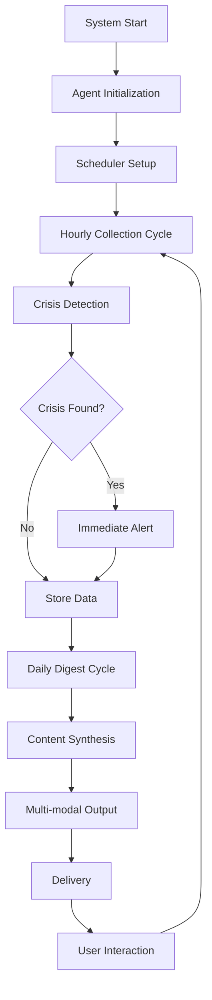

# 🎓 Al Zait: Complete Learning Guide for Agentic Workflows & Cloud Deployment

## 📖 Table of Contents
1. [Agentic Architecture & Design Patterns](#agentic-architecture)
2. [Multi-Agent System Lifecycle](#multi-agent-lifecycle)
3. [RAG System Implementation](#rag-system)
4. [LangGraph Workflow Orchestration](#langgraph-workflow)
5. [Vector Database Deep Dive](#vector-database)
6. [LLM Integration Patterns](#llm-integration)
7. [Cloud-Native Deployment Journey](#cloud-deployment)
8. [Production-Ready AI Systems](#production-ai)
9. [Monitoring & Observability](#monitoring)
10. [Security & Compliance](#security)
11. [Performance Optimization](#performance)
12. [Cost Management Strategies](#cost-management)
13. [Troubleshooting & Debugging](#troubleshooting)
14. [Key Learnings & Best Practices](#key-learnings)

---

## 🤖 1. Agentic Architecture & Design Patterns {#agentic-architecture}

### Understanding Agentic Systems: From Theory to Practice

Agentic systems represent a fundamental shift from traditional monolithic applications to autonomous, intelligent components that can reason, plan, and execute tasks independently. Our Al Zait system exemplifies modern agentic architecture with three specialized agents working in harmony.

#### The Philosophy Behind Agent-Based Design

**Traditional Approach:**
```python
# Monolithic news processing system
class NewsProcessor:
    def process_everything(self):
        articles = self.fetch_news()        # Single responsibility violation
        filtered = self.filter_articles()   # Mixed concerns
        summary = self.create_summary()     # Tightly coupled
        self.send_notification()            # No separation of concerns
        return summary
```

**Agentic Approach:**
```python
# Agent-based architecture with clear separation
class CollectorAgent(Agent):
    """Autonomous news collection with crisis detection"""
    
    def __init__(self, config: AgentConfig):
        super().__init__(config)
        self.news_sources = self._initialize_sources()
        self.crisis_detector = CrisisDetectionEngine()
        self.vector_store = VectorStoreClient()
        
    async def execute_collection_cycle(self) -> CollectionResult:
        """Main agent execution loop with autonomous decision making"""
        
        # 1. Autonomous source selection based on performance metrics
        active_sources = await self._select_optimal_sources()
        
        # 2. Parallel news fetching with concurrent processing
        raw_articles = await asyncio.gather(*[
            self._fetch_from_source(source) for source in active_sources
        ])
        
        # 3. Intelligent filtering with ML-based relevance scoring
        processed_articles = await self._intelligent_filtering(raw_articles)
        
        # 4. Crisis detection with real-time alerting
        crisis_events = await self.crisis_detector.analyze(processed_articles)
        
        # 5. Vector storage with semantic indexing
        await self.vector_store.store_with_embeddings(processed_articles)
        
        # 6. Agent-to-agent communication
        if crisis_events:
            await self.notify_other_agents(crisis_events)
            
        return CollectionResult(
            articles_processed=len(processed_articles),
            crisis_events=crisis_events,
            performance_metrics=self._get_performance_metrics()
        )
```

### Detailed Agent Architecture Implementation

#### Core Agent Base Class with Advanced Capabilities

```python
from abc import ABC, abstractmethod
from typing import Any, Dict, List, Optional
from dataclasses import dataclass
from enum import Enum
import asyncio
import logging
from datetime import datetime, timezone

class AgentState(Enum):
    INITIALIZING = "initializing"
    IDLE = "idle"
    PROCESSING = "processing"
    ERROR = "error"
    SHUTDOWN = "shutdown"

@dataclass
class AgentConfig:
    name: str
    max_concurrent_tasks: int = 5
    retry_attempts: int = 3
    timeout_seconds: int = 300
    health_check_interval: int = 60
    log_level: str = "INFO"

@dataclass 
class AgentMetrics:
    tasks_completed: int = 0
    tasks_failed: int = 0
    average_execution_time: float = 0.0
    last_execution_time: Optional[datetime] = None
    memory_usage_mb: float = 0.0
    cpu_usage_percent: float = 0.0

class Agent(ABC):
    """Base agent class with comprehensive functionality"""
    
    def __init__(self, config: AgentConfig):
        self.config = config
        self.state = AgentState.INITIALIZING
        self.metrics = AgentMetrics()
        self.logger = self._setup_logging()
        self.task_queue = asyncio.Queue()
        self.is_running = False
        self.health_monitor = None
        
    def _setup_logging(self) -> logging.Logger:
        """Configure structured logging for the agent"""
        logger = logging.getLogger(f"agent.{self.config.name}")
        logger.setLevel(getattr(logging, self.config.log_level))
        
        handler = logging.StreamHandler()
        formatter = logging.Formatter(
            '%(asctime)s - %(name)s - %(levelname)s - %(message)s'
        )
        handler.setFormatter(formatter)
        logger.addHandler(handler)
        
        return logger
        
    async def start(self):
        """Start the agent with full initialization"""
        try:
            self.logger.info(f"Starting agent: {self.config.name}")
            self.state = AgentState.IDLE
            
            # Initialize agent-specific resources
            await self.initialize()
            
            # Start health monitoring
            self.health_monitor = asyncio.create_task(self._health_check_loop())
            
            # Start main processing loop
            self.is_running = True
            await self._main_loop()
            
        except Exception as e:
            self.logger.error(f"Agent startup failed: {e}")
            self.state = AgentState.ERROR
            raise
            
    async def stop(self):
        """Graceful agent shutdown"""
        self.logger.info(f"Stopping agent: {self.config.name}")
        self.is_running = False
        self.state = AgentState.SHUTDOWN
        
        if self.health_monitor:
            self.health_monitor.cancel()
            
        await self.cleanup()
        
    @abstractmethod
    async def initialize(self):
        """Agent-specific initialization logic"""
        pass
        
    @abstractmethod
    async def process_task(self, task: Any) -> Any:
        """Agent-specific task processing"""
        pass
        
    @abstractmethod
    async def cleanup(self):
        """Agent-specific cleanup logic"""
        pass
        
    async def _main_loop(self):
        """Main agent processing loop with error handling"""
        while self.is_running:
            try:
                # Wait for tasks with timeout
                task = await asyncio.wait_for(
                    self.task_queue.get(), 
                    timeout=1.0
                )
                
                # Process task with metrics collection
                start_time = datetime.now(timezone.utc)
                
                try:
                    self.state = AgentState.PROCESSING
                    result = await self.process_task(task)
                    
                    # Update success metrics
                    execution_time = (datetime.now(timezone.utc) - start_time).total_seconds()
                    self._update_metrics(execution_time, success=True)
                    
                    self.logger.info(f"Task completed in {execution_time:.2f}s")
                    
                except Exception as e:
                    # Update failure metrics
                    self._update_metrics(0, success=False)
                    self.logger.error(f"Task processing failed: {e}")
                    
                finally:
                    self.state = AgentState.IDLE
                    self.task_queue.task_done()
                    
            except asyncio.TimeoutError:
                # No tasks available, continue loop
                continue
            except Exception as e:
                self.logger.error(f"Main loop error: {e}")
                await asyncio.sleep(1)  # Brief pause before retrying
                
    def _update_metrics(self, execution_time: float, success: bool):
        """Update agent performance metrics"""
        if success:
            self.metrics.tasks_completed += 1
            # Update rolling average execution time
            total_tasks = self.metrics.tasks_completed
            current_avg = self.metrics.average_execution_time
            self.metrics.average_execution_time = (
                (current_avg * (total_tasks - 1) + execution_time) / total_tasks
            )
        else:
            self.metrics.tasks_failed += 1
            
        self.metrics.last_execution_time = datetime.now(timezone.utc)
        
    async def _health_check_loop(self):
        """Continuous health monitoring"""
        while self.is_running:
            try:
                # Collect system metrics
                import psutil
                process = psutil.Process()
                
                self.metrics.memory_usage_mb = process.memory_info().rss / 1024 / 1024
                self.metrics.cpu_usage_percent = process.cpu_percent()
                
                # Custom health checks
                health_status = await self.health_check()
                
                if not health_status:
                    self.logger.warning("Agent health check failed")
                    
                await asyncio.sleep(self.config.health_check_interval)
                
            except Exception as e:
                self.logger.error(f"Health check error: {e}")
                await asyncio.sleep(self.config.health_check_interval)
                
    async def health_check(self) -> bool:
        """Override in subclasses for custom health checks"""
        return True
        
    def get_status(self) -> Dict[str, Any]:
        """Get comprehensive agent status"""
        return {
            'name': self.config.name,
            'state': self.state.value,
            'metrics': {
                'tasks_completed': self.metrics.tasks_completed,
                'tasks_failed': self.metrics.tasks_failed,
                'success_rate': (
                    self.metrics.tasks_completed / 
                    max(1, self.metrics.tasks_completed + self.metrics.tasks_failed)
                ) * 100,
                'average_execution_time': self.metrics.average_execution_time,
                'memory_usage_mb': self.metrics.memory_usage_mb,
                'cpu_usage_percent': self.metrics.cpu_usage_percent,
                'last_execution': self.metrics.last_execution_time.isoformat() if self.metrics.last_execution_time else None
            },
            'queue_size': self.task_queue.qsize(),
            'is_running': self.is_running
        }
```

#### Collector Agent: Complete Implementation with Advanced Features

```python
from typing import List, Dict, Any, Optional
from dataclasses import dataclass
from datetime import datetime, timedelta
import aiohttp
import asyncio
from urllib.parse import urljoin
import hashlib

@dataclass
class NewsSource:
    name: str
    url: str
    source_type: str  # 'api', 'rss', 'scraping'
    priority: int = 1
    rate_limit: int = 100  # requests per hour
    last_request: Optional[datetime] = None
    success_rate: float = 1.0
    average_response_time: float = 0.0

@dataclass
class Article:
    id: str
    title: str
    content: str
    url: str
    source: str
    published_at: datetime
    language: str = 'en'
    relevance_score: float = 0.0
    crisis_indicators: List[str] = None
    embedding: List[float] = None
    
    def __post_init__(self):
        if self.crisis_indicators is None:
            self.crisis_indicators = []

class CollectorAgent(Agent):
    """Advanced news collection agent with intelligent source management"""
    
    def __init__(self, config: AgentConfig):
        super().__init__(config)
        self.news_sources: List[NewsSource] = []
        self.session: Optional[aiohttp.ClientSession] = None
        self.crisis_detector = CrisisDetectionEngine()
        self.content_filter = ContentFilterEngine()
        self.rate_limiter = RateLimiter()
        
    async def initialize(self):
        """Initialize collector agent resources"""
        self.logger.info("Initializing Collector Agent")
        
        # Setup HTTP session with connection pooling
        connector = aiohttp.TCPConnector(
            limit=20,  # Total connection pool size
            limit_per_host=5,  # Connections per host
            ttl_dns_cache=300,  # DNS cache TTL
            use_dns_cache=True
        )
        
        timeout = aiohttp.ClientTimeout(
            total=30,      # Total timeout
            connect=10,    # Connection timeout
            sock_read=20   # Socket read timeout
        )
        
        self.session = aiohttp.ClientSession(
            connector=connector,
            timeout=timeout,
            headers={'User-Agent': 'Al-Zait-News-Agent/1.0'}
        )
        
        # Initialize news sources
        await self._load_news_sources()
        
        # Initialize ML components
        await self.crisis_detector.initialize()
        await self.content_filter.initialize()
        
        self.logger.info(f"Collector Agent initialized with {len(self.news_sources)} sources")
        
    async def _load_news_sources(self):
        """Load and validate news sources"""
        # NewsAPI sources
        self.news_sources.extend([
            NewsSource(
                name="NewsAPI_General",
                url="https://newsapi.org/v2/everything",
                source_type="api",
                priority=1,
                rate_limit=100
            ),
            NewsSource(
                name="NewsAPI_Sudan", 
                url="https://newsapi.org/v2/everything",
                source_type="api",
                priority=2,
                rate_limit=100
            )
        ])
        
        # RSS sources with validation
        rss_sources = [
            ("AlJazeera_Arabic", "https://www.aljazeera.com/xml/rss/all.xml"),
            ("BBC_Arabic", "https://feeds.bbci.co.uk/arabic/rss.xml"),
            ("Sudan_Tribune", "http://www.sudantribune.com/spip.php?page=backend")
        ]
        
        for name, url in rss_sources:
            if await self._validate_rss_source(url):
                self.news_sources.append(NewsSource(
                    name=name,
                    url=url,
                    source_type="rss",
                    priority=3,
                    rate_limit=50
                ))
            else:
                self.logger.warning(f"RSS source validation failed: {name}")
                
    async def _validate_rss_source(self, url: str) -> bool:
        """Validate RSS source availability and format"""
        try:
            async with self.session.get(url) as response:
                if response.status == 200:
                    content = await response.text()
                    return '<rss' in content or '<feed' in content
                return False
        except Exception as e:
            self.logger.error(f"RSS validation error for {url}: {e}")
            return False
            
    async def process_task(self, task: Any) -> Dict[str, Any]:
        """Main task processing: complete news collection cycle"""
        
        collection_start = datetime.now()
        
        try:
            # 1. Select optimal sources based on performance
            selected_sources = await self._select_optimal_sources()
            
            # 2. Fetch articles from all sources concurrently
            all_articles = await self._fetch_from_all_sources(selected_sources)
            
            # 3. Deduplicate articles
            unique_articles = await self._deduplicate_articles(all_articles)
            
            # 4. Apply content filtering and relevance scoring
            filtered_articles = await self._filter_and_score_articles(unique_articles)
            
            # 5. Crisis detection analysis
            crisis_events = await self._analyze_for_crisis(filtered_articles)
            
            # 6. Store in vector database with embeddings
            storage_result = await self._store_articles(filtered_articles)
            
            # 7. Generate collection report
            collection_time = datetime.now() - collection_start
            
            result = {
                'status': 'success',
                'articles_fetched': len(all_articles),
                'articles_after_dedup': len(unique_articles),
                'articles_stored': len(filtered_articles),
                'crisis_events': len(crisis_events),
                'collection_time_seconds': collection_time.total_seconds(),
                'sources_used': [s.name for s in selected_sources],
                'storage_result': storage_result
            }
            
            # Send crisis alerts if detected
            if crisis_events:
                await self._send_crisis_alerts(crisis_events)
                result['crisis_alert_sent'] = True
                
            return result
            
        except Exception as e:
            self.logger.error(f"Collection cycle failed: {e}")
            return {
                'status': 'error',
                'error': str(e),
                'collection_time_seconds': (datetime.now() - collection_start).total_seconds()
            }
            
    async def _select_optimal_sources(self) -> List[NewsSource]:
        """Intelligent source selection based on performance metrics"""
        
        available_sources = []
        
        for source in self.news_sources:
            # Check rate limiting
            if await self.rate_limiter.can_make_request(source.name, source.rate_limit):
                # Consider source performance
                performance_score = (
                    source.success_rate * 0.6 +  # Success rate weight
                    (1.0 / max(source.average_response_time, 0.1)) * 0.3 +  # Speed weight  
                    (1.0 / source.priority) * 0.1  # Priority weight
                )
                available_sources.append((source, performance_score))
        
        # Sort by performance score and select top sources
        available_sources.sort(key=lambda x: x[1], reverse=True)
        
        # Select top 70% of sources or minimum 2 sources
        num_sources = max(2, int(len(available_sources) * 0.7))
        selected = [source for source, _ in available_sources[:num_sources]]
        
        self.logger.info(f"Selected {len(selected)} sources for collection")
        return selected
        
    async def _fetch_from_all_sources(self, sources: List[NewsSource]) -> List[Article]:
        """Fetch articles from all sources concurrently with error handling"""
        
        fetch_tasks = []
        for source in sources:
            task = asyncio.create_task(
                self._fetch_from_single_source(source),
                name=f"fetch_{source.name}"
            )
            fetch_tasks.append(task)
        
        # Wait for all tasks with timeout
        try:
            results = await asyncio.gather(*fetch_tasks, return_exceptions=True)
            
            all_articles = []
            for source, result in zip(sources, results):
                if isinstance(result, Exception):
                    self.logger.error(f"Source {source.name} failed: {result}")
                    # Update source performance metrics
                    source.success_rate = max(0.1, source.success_rate * 0.9)
                else:
                    all_articles.extend(result)
                    # Update source performance metrics
                    source.success_rate = min(1.0, source.success_rate * 1.1)
                    
            return all_articles
            
        except Exception as e:
            self.logger.error(f"Concurrent fetching failed: {e}")
            return []
            
    async def _fetch_from_single_source(self, source: NewsSource) -> List[Article]:
        """Fetch articles from a single source with proper error handling"""
        
        start_time = datetime.now()
        
        try:
            if source.source_type == "api":
                articles = await self._fetch_from_api(source)
            elif source.source_type == "rss":
                articles = await self._fetch_from_rss(source)
            else:
                self.logger.warning(f"Unknown source type: {source.source_type}")
                return []
                
            # Update response time metrics
            response_time = (datetime.now() - start_time).total_seconds()
            source.average_response_time = (
                (source.average_response_time + response_time) / 2
                if source.average_response_time > 0
                else response_time
            )
            source.last_request = datetime.now()
            
            self.logger.info(f"Fetched {len(articles)} articles from {source.name}")
            return articles
            
        except Exception as e:
            self.logger.error(f"Failed to fetch from {source.name}: {e}")
            return []
            
    async def _fetch_from_api(self, source: NewsSource) -> List[Article]:
        """Fetch from NewsAPI with proper query construction"""
        
        from src.utils.config import Config
        
        # Construct API parameters
        params = {
            'apiKey': Config.NEWSAPI_KEY,
            'language': 'ar,en',
            'sortBy': 'publishedAt',
            'pageSize': Config.MAX_ARTICLES_PER_QUERY,
            'from': (datetime.now() - timedelta(hours=24)).isoformat()
        }
        
        # Add search queries
        if "Sudan" in source.name:
            params['q'] = ' OR '.join(Config.get_all_search_queries())
        else:
            params['q'] = 'breaking news OR crisis OR emergency'
            
        try:
            async with self.session.get(source.url, params=params) as response:
                if response.status == 200:
                    data = await response.json()
                    return self._parse_newsapi_response(data, source.name)
                else:
                    self.logger.error(f"API error {response.status}: {await response.text()}")
                    return []
                    
        except Exception as e:
            self.logger.error(f"NewsAPI fetch error: {e}")
            return []
            
    def _parse_newsapi_response(self, data: Dict, source_name: str) -> List[Article]:
        """Parse NewsAPI response into Article objects"""
        
        articles = []
        
        for item in data.get('articles', []):
            try:
                # Generate unique ID
                article_id = hashlib.md5(
                    f"{item['url']}{item['publishedAt']}".encode()
                ).hexdigest()
                
                # Parse published date
                published_at = datetime.fromisoformat(
                    item['publishedAt'].replace('Z', '+00:00')
                )
                
                # Detect language
                content = f"{item.get('title', '')} {item.get('description', '')}"
                language = self._detect_language(content)
                
                article = Article(
                    id=article_id,
                    title=item.get('title', ''),
                    content=item.get('description', ''),
                    url=item['url'],
                    source=source_name,
                    published_at=published_at,
                    language=language
                )
                
                articles.append(article)
                
            except Exception as e:
                self.logger.warning(f"Failed to parse article: {e}")
                continue
                
        return articles
        
    async def _fetch_from_rss(self, source: NewsSource) -> List[Article]:
        """Fetch and parse RSS feeds"""
        
        try:
            async with self.session.get(source.url) as response:
                if response.status == 200:
                    xml_content = await response.text()
                    return await self._parse_rss_content(xml_content, source.name)
                else:
                    self.logger.error(f"RSS fetch error {response.status}")
                    return []
                    
        except Exception as e:
            self.logger.error(f"RSS fetch error: {e}")
            return []
            
    async def _parse_rss_content(self, xml_content: str, source_name: str) -> List[Article]:
        """Parse RSS XML content"""
        
        import feedparser
        
        try:
            feed = feedparser.parse(xml_content)
            articles = []
            
            for entry in feed.entries:
                # Generate unique ID
                article_id = hashlib.md5(
                    f"{entry.link}{entry.get('published', '')}".encode()
                ).hexdigest()
                
                # Parse published date
                published_at = datetime.now()
                if hasattr(entry, 'published_parsed') and entry.published_parsed:
                    import time
                    published_at = datetime.fromtimestamp(
                        time.mktime(entry.published_parsed)
                    )
                
                # Extract content
                content = (
                    entry.get('summary', '') or 
                    entry.get('description', '') or 
                    entry.get('content', [{}])[0].get('value', '')
                )
                
                # Detect language
                full_text = f"{entry.title} {content}"
                language = self._detect_language(full_text)
                
                article = Article(
                    id=article_id,
                    title=entry.title,
                    content=content,
                    url=entry.link,
                    source=source_name,
                    published_at=published_at,
                    language=language
                )
                
                articles.append(article)
                
            return articles
            
        except Exception as e:
            self.logger.error(f"RSS parsing error: {e}")
            return []
            
    def _detect_language(self, text: str) -> str:
        """Simple language detection"""
        
        # Arabic character detection
        arabic_chars = sum(1 for char in text if '\u0600' <= char <= '\u06FF')
        total_chars = len([char for char in text if char.isalpha()])
        
        if total_chars > 0 and (arabic_chars / total_chars) > 0.3:
            return 'ar'
        return 'en'
        
    async def _deduplicate_articles(self, articles: List[Article]) -> List[Article]:
        """Remove duplicate articles using multiple strategies"""
        
        seen_urls = set()
        seen_titles = set()
        unique_articles = []
        
        for article in articles:
            # URL-based deduplication
            if article.url in seen_urls:
                continue
                
            # Title similarity-based deduplication
            title_hash = hashlib.md5(article.title.lower().encode()).hexdigest()
            if title_hash in seen_titles:
                continue
                
            seen_urls.add(article.url)
            seen_titles.add(title_hash)
            unique_articles.append(article)
            
        self.logger.info(f"Deduplication: {len(articles)} -> {len(unique_articles)}")
        return unique_articles
        
    async def cleanup(self):
        """Clean up resources"""
        if self.session:
            await self.session.close()
        
        if hasattr(self, 'crisis_detector'):
            await self.crisis_detector.cleanup()
            
        if hasattr(self, 'content_filter'):
            await self.content_filter.cleanup()
```

---

## 🔄 2. Multi-Agent System Lifecycle {#multi-agent-lifecycle}

### Complete Agent Orchestration and Communication Patterns

The lifecycle of our multi-agent system involves complex coordination between autonomous components, each with its own execution patterns, communication protocols, and state management strategies.

#### Agent Communication Architecture

```python
from enum import Enum
from typing import Dict, Any, List, Optional, Union
from dataclasses import dataclass, field
from datetime import datetime
import asyncio
import json

class MessageType(Enum):
    TASK_REQUEST = "task_request"
    TASK_RESPONSE = "task_response"
    STATUS_UPDATE = "status_update"
    CRISIS_ALERT = "crisis_alert"
    SHUTDOWN_SIGNAL = "shutdown_signal"
    HEALTH_CHECK = "health_check"

@dataclass
class AgentMessage:
    id: str
    sender: str
    recipient: str
    message_type: MessageType
    payload: Dict[str, Any]
    timestamp: datetime = field(default_factory=datetime.now)
    priority: int = 1  # 1=low, 5=critical
    correlation_id: Optional[str] = None

class MessageBus:
    """Advanced message bus for inter-agent communication"""
    
    def __init__(self):
        self.subscribers: Dict[str, List[callable]] = {}
        self.message_history: List[AgentMessage] = []
        self.pending_responses: Dict[str, asyncio.Future] = {}
        self.lock = asyncio.Lock()
        
    async def subscribe(self, agent_name: str, message_type: MessageType, handler: callable):
        """Subscribe agent to specific message types"""
        key = f"{agent_name}:{message_type.value}"
        if key not in self.subscribers:
            self.subscribers[key] = []
        self.subscribers[key].append(handler)
        
    async def publish(self, message: AgentMessage) -> Optional[Any]:
        """Publish message with delivery guarantees"""
        async with self.lock:
            self.message_history.append(message)
            
            # Route to specific recipient or broadcast
            if message.recipient == "*":
                await self._broadcast_message(message)
            else:
                await self._deliver_message(message)
                
            # Handle request-response pattern
            if message.message_type == MessageType.TASK_REQUEST:
                future = asyncio.Future()
                self.pending_responses[message.id] = future
                return await asyncio.wait_for(future, timeout=300)  # 5 minute timeout
                
    async def _broadcast_message(self, message: AgentMessage):
        """Broadcast message to all subscribers"""
        for key, handlers in self.subscribers.items():
            if key.endswith(f":{message.message_type.value}"):
                for handler in handlers:
                    asyncio.create_task(self._safe_handler_call(handler, message))
                    
    async def _deliver_message(self, message: AgentMessage):
        """Deliver message to specific recipient"""
        key = f"{message.recipient}:{message.message_type.value}"
        if key in self.subscribers:
            for handler in self.subscribers[key]:
                asyncio.create_task(self._safe_handler_call(handler, message))
                
    async def _safe_handler_call(self, handler: callable, message: AgentMessage):
        """Safe handler execution with error isolation"""
        try:
            result = await handler(message)
            
            # Handle response for request-response pattern
            if message.correlation_id and message.correlation_id in self.pending_responses:
                self.pending_responses[message.correlation_id].set_result(result)
                
        except Exception as e:
            print(f"Handler error: {e}")
            if message.correlation_id and message.correlation_id in self.pending_responses:
                self.pending_responses[message.correlation_id].set_exception(e)
```

#### Advanced Agent Coordinator

```python
class AgentCoordinator:
    """Central coordinator for managing agent lifecycle and interactions"""
    
    def __init__(self):
        self.agents: Dict[str, Agent] = {}
        self.message_bus = MessageBus()
        self.scheduler = None
        self.coordinator_state = "initializing"
        self.performance_monitor = PerformanceMonitor()
        
    async def initialize(self):
        """Initialize the complete agent ecosystem"""
        self.coordinator_state = "initializing"
        
        # 1. Initialize message bus
        await self.message_bus.initialize()
        
        # 2. Create and initialize agents
        await self._create_agents()
        
        # 3. Setup inter-agent communication
        await self._setup_agent_communication()
        
        # 4. Initialize scheduler
        await self._setup_scheduler()
        
        # 5. Start performance monitoring
        await self.performance_monitor.start()
        
        self.coordinator_state = "running"
        
    async def _create_agents(self):
        """Create all system agents with proper configuration"""
        
        # Collector Agent Configuration
        collector_config = AgentConfig(
            name="collector",
            max_concurrent_tasks=3,
            retry_attempts=3,
            timeout_seconds=600,  # 10 minutes for news collection
            health_check_interval=30
        )
        
        # Editor Agent Configuration  
        editor_config = AgentConfig(
            name="editor",
            max_concurrent_tasks=2,
            retry_attempts=2,
            timeout_seconds=900,  # 15 minutes for content generation
            health_check_interval=60
        )
        
        # Interactive Analyst Configuration
        analyst_config = AgentConfig(
            name="analyst",
            max_concurrent_tasks=5,
            retry_attempts=1,
            timeout_seconds=30,  # Quick response for user queries
            health_check_interval=15
        )
        
        # Instantiate agents
        self.agents["collector"] = CollectorAgent(collector_config)
        self.agents["editor"] = EditorAgent(editor_config)
        self.agents["analyst"] = InteractiveAnalyst(analyst_config)
        
        # Initialize all agents
        initialization_tasks = [
            agent.initialize() for agent in self.agents.values()
        ]
        
        try:
            await asyncio.gather(*initialization_tasks)
            print(f"✅ All {len(self.agents)} agents initialized successfully")
        except Exception as e:
            print(f"❌ Agent initialization failed: {e}")
            raise
            
    async def _setup_agent_communication(self):
        """Configure inter-agent message routing"""
        
        # Collector Agent Subscriptions
        collector = self.agents["collector"]
        await self.message_bus.subscribe(
            "collector", 
            MessageType.TASK_REQUEST, 
            collector.handle_collection_request
        )
        
        # Editor Agent Subscriptions
        editor = self.agents["editor"]
        await self.message_bus.subscribe(
            "editor",
            MessageType.TASK_REQUEST,
            editor.handle_digest_request
        )
        await self.message_bus.subscribe(
            "editor",
            MessageType.CRISIS_ALERT,
            editor.handle_crisis_alert
        )
        
        # Analyst Agent Subscriptions
        analyst = self.agents["analyst"]
        await self.message_bus.subscribe(
            "analyst",
            MessageType.TASK_REQUEST,
            analyst.handle_query_request
        )
        
        # Setup cross-agent notifications
        for agent_name, agent in self.agents.items():
            await self.message_bus.subscribe(
                agent_name,
                MessageType.STATUS_UPDATE,
                self._handle_agent_status_update
            )
            
    async def _setup_scheduler(self):
        """Configure automated task scheduling"""
        
        from apscheduler.schedulers.asyncio import AsyncIOScheduler
        from apscheduler.triggers.cron import CronTrigger
        
        self.scheduler = AsyncIOScheduler()
        
        # Hourly news collection
        self.scheduler.add_job(
            func=self._trigger_collection,
            trigger=CronTrigger(minute=0),  # Every hour at minute 0
            id="hourly_collection",
            name="Hourly News Collection",
            replace_existing=True,
            max_instances=1
        )
        
        # Daily digest creation (8 AM)
        self.scheduler.add_job(
            func=self._trigger_digest_creation,
            trigger=CronTrigger(hour=8, minute=0),
            id="daily_digest", 
            name="Daily News Digest",
            replace_existing=True,
            max_instances=1
        )
        
        # System health check (every 5 minutes)
        self.scheduler.add_job(
            func=self._perform_health_check,
            trigger=CronTrigger(minute="*/5"),
            id="health_check",
            name="System Health Check", 
            replace_existing=True
        )
        
        self.scheduler.start()
        
    async def _trigger_collection(self):
        """Trigger news collection cycle"""
        message = AgentMessage(
            id=f"collection_{datetime.now().timestamp()}",
            sender="coordinator",
            recipient="collector",
            message_type=MessageType.TASK_REQUEST,
            payload={"task_type": "full_collection"}
        )
        
        try:
            result = await self.message_bus.publish(message)
            print(f"✅ Collection completed: {result}")
            
            # If crisis detected, notify editor immediately
            if result.get("crisis_events"):
                await self._handle_crisis_events(result["crisis_events"])
                
        except Exception as e:
            print(f"❌ Collection failed: {e}")
            
    async def _trigger_digest_creation(self):
        """Trigger daily digest creation"""
        message = AgentMessage(
            id=f"digest_{datetime.now().timestamp()}",
            sender="coordinator",
            recipient="editor",
            message_type=MessageType.TASK_REQUEST,
            payload={"task_type": "create_digest", "timeframe": "24_hours"}
        )
        
        try:
            result = await self.message_bus.publish(message)
            print(f"✅ Daily digest created: {result}")
        except Exception as e:
            print(f"❌ Digest creation failed: {e}")
            
    async def _handle_crisis_events(self, crisis_events: List[Dict]):
        """Handle detected crisis events with immediate response"""
        
        crisis_message = AgentMessage(
            id=f"crisis_{datetime.now().timestamp()}",
            sender="coordinator",
            recipient="editor",
            message_type=MessageType.CRISIS_ALERT,
            payload={
                "crisis_events": crisis_events,
                "urgency": "immediate"
            },
            priority=5  # Highest priority
        )
        
        try:
            # Send immediate crisis digest
            result = await self.message_bus.publish(crisis_message)
            print(f"🚨 Crisis alert processed: {result}")
        except Exception as e:
            print(f"❌ Crisis alert failed: {e}")
            
    async def _perform_health_check(self):
        """Comprehensive system health check"""
        
        health_status = {
            "timestamp": datetime.now().isoformat(),
            "coordinator_status": self.coordinator_state,
            "agents": {},
            "message_bus": {
                "message_count": len(self.message_bus.message_history),
                "pending_responses": len(self.message_bus.pending_responses)
            }
        }
        
        # Check each agent health
        for agent_name, agent in self.agents.items():
            try:
                agent_status = agent.get_status()
                health_status["agents"][agent_name] = agent_status
                
                # Alert if agent is unhealthy
                if agent_status["state"] == "error":
                    await self._handle_unhealthy_agent(agent_name, agent_status)
                    
            except Exception as e:
                health_status["agents"][agent_name] = {"error": str(e)}
                
        # Store health metrics
        await self.performance_monitor.record_health_check(health_status)
        
    async def _handle_unhealthy_agent(self, agent_name: str, status: Dict):
        """Handle unhealthy agent detection"""
        
        print(f"⚠️ Unhealthy agent detected: {agent_name}")
        
        # Attempt agent restart
        try:
            agent = self.agents[agent_name]
            await agent.stop()
            await asyncio.sleep(5)  # Brief pause
            await agent.start()
            
            print(f"✅ Agent {agent_name} restarted successfully")
            
        except Exception as e:
            print(f"❌ Failed to restart agent {agent_name}: {e}")
            # Could implement fallback strategies here
            
    async def get_system_status(self) -> Dict[str, Any]:
        """Get comprehensive system status"""
        
        return {
            "coordinator_state": self.coordinator_state,
            "agent_count": len(self.agents),
            "agents": {
                name: agent.get_status() 
                for name, agent in self.agents.items()
            },
            "scheduler": {
                "running": self.scheduler.running if self.scheduler else False,
                "jobs": [
                    {
                        "id": job.id,
                        "name": job.name,
                        "next_run_time": job.next_run_time.isoformat() if job.next_run_time else None
                    }
                    for job in (self.scheduler.get_jobs() if self.scheduler else [])
                ]
            },
            "performance_metrics": await self.performance_monitor.get_current_metrics()
        }
        
    async def shutdown(self):
        """Graceful system shutdown"""
        
        self.coordinator_state = "shutting_down"
        
        # Stop scheduler
        if self.scheduler and self.scheduler.running:
            self.scheduler.shutdown(wait=True)
            
        # Stop all agents
        shutdown_tasks = [
            agent.stop() for agent in self.agents.values()
        ]
        
        try:
            await asyncio.gather(*shutdown_tasks)
            print("✅ All agents stopped successfully")
        except Exception as e:
            print(f"⚠️ Some agents failed to stop cleanly: {e}")
            
        # Stop performance monitoring
        await self.performance_monitor.stop()
        
        self.coordinator_state = "stopped"
```

#### Advanced Crisis Detection Engine

```python
class CrisisDetectionEngine:
    """ML-powered crisis detection with multi-layered analysis"""
    
    def __init__(self):
        self.crisis_keywords = {
            'ar': [
                'أزمة', 'كارثة', 'حرب', 'عاجل', 'طوارئ', 'انفجار', 
                'هجوم', 'قتلى', 'جرحى', 'إطلاق نار', 'تفجير'
            ],
            'en': [
                'crisis', 'emergency', 'breaking', 'urgent', 'disaster',
                'explosion', 'attack', 'casualties', 'shooting', 'bomb'
            ]
        }
        self.severity_weights = {
            'high_impact': ['war', 'حرب', 'disaster', 'كارثة'],
            'medium_impact': ['crisis', 'أزمة', 'emergency', 'طوارئ'],
            'low_impact': ['urgent', 'عاجل', 'breaking']
        }
        self.ml_classifier = None
        
    async def initialize(self):
        """Initialize ML components for crisis detection"""
        
        # Load pre-trained crisis classification model
        try:
            from transformers import pipeline
            self.ml_classifier = pipeline(
                "text-classification",
                model="cardiffnlp/twitter-roberta-base-sentiment",
                device=0 if torch.cuda.is_available() else -1
            )
        except Exception as e:
            print(f"Warning: ML classifier not available: {e}")
            
    async def analyze(self, articles: List[Article]) -> List[Dict[str, Any]]:
        """Comprehensive crisis analysis of articles"""
        
        crisis_events = []
        
        # 1. Keyword-based detection
        keyword_alerts = await self._keyword_analysis(articles)
        
        # 2. ML-based sentiment and urgency analysis
        ml_alerts = await self._ml_analysis(articles)
        
        # 3. Temporal clustering analysis
        temporal_alerts = await self._temporal_analysis(articles)
        
        # 4. Cross-reference and scoring
        combined_alerts = await self._combine_and_score_alerts(
            keyword_alerts, ml_alerts, temporal_alerts
        )
        
        # 5. Filter by confidence threshold
        high_confidence_alerts = [
            alert for alert in combined_alerts 
            if alert['confidence'] > 0.7
        ]
        
        return high_confidence_alerts
        
    async def _keyword_analysis(self, articles: List[Article]) -> List[Dict]:
        """Keyword-based crisis detection"""
        
        alerts = []
        
        for article in articles:
            crisis_score = 0
            detected_keywords = []
            
            # Check for crisis keywords in title and content
            text = f"{article.title} {article.content}".lower()
            
            for severity, keywords in self.severity_weights.items():
                for keyword in keywords:
                    if keyword.lower() in text:
                        weight = {'high_impact': 3, 'medium_impact': 2, 'low_impact': 1}[severity]
                        crisis_score += weight
                        detected_keywords.append(keyword)
                        
            # Consider article recency
            hours_old = (datetime.now() - article.published_at).total_seconds() / 3600
            recency_multiplier = max(0.5, 1 - (hours_old / 24))  # Decay over 24 hours
            
            final_score = crisis_score * recency_multiplier
            
            if final_score > 2:  # Crisis threshold
                alerts.append({
                    'type': 'keyword_based',
                    'article_id': article.id,
                    'score': final_score,
                    'keywords': detected_keywords,
                    'confidence': min(0.8, final_score / 5),
                    'article': article
                })
                
        return alerts
        
    async def _ml_analysis(self, articles: List[Article]) -> List[Dict]:
        """ML-based crisis detection using sentiment analysis"""
        
        if not self.ml_classifier:
            return []
            
        alerts = []
        
        for article in articles:
            try:
                # Analyze title and content separately
                title_analysis = self.ml_classifier(article.title)
                content_analysis = self.ml_classifier(article.content[:512])  # Truncate for model
                
                # Look for negative sentiment with high confidence
                title_negative = any(
                    result['label'] == 'NEGATIVE' and result['score'] > 0.8 
                    for result in title_analysis
                )
                
                content_negative = any(
                    result['label'] == 'NEGATIVE' and result['score'] > 0.7
                    for result in content_analysis
                )
                
                if title_negative and content_negative:
                    confidence = (
                        max([r['score'] for r in title_analysis if r['label'] == 'NEGATIVE'], default=0) +
                        max([r['score'] for r in content_analysis if r['label'] == 'NEGATIVE'], default=0)
                    ) / 2
                    
                    alerts.append({
                        'type': 'ml_sentiment',
                        'article_id': article.id,
                        'score': confidence * 5,  # Scale to match keyword scoring
                        'confidence': confidence,
                        'title_sentiment': title_analysis,
                        'content_sentiment': content_analysis,
                        'article': article
                    })
                    
            except Exception as e:
                print(f"ML analysis failed for article {article.id}: {e}")
                continue
                
        return alerts
        
    async def _temporal_analysis(self, articles: List[Article]) -> List[Dict]:
        """Detect crisis patterns through temporal clustering"""
        
        alerts = []
        
        # Group articles by time windows (1-hour buckets)
        time_buckets = {}
        
        for article in articles:
            # Round to nearest hour
            hour_key = article.published_at.replace(minute=0, second=0, microsecond=0)
            
            if hour_key not in time_buckets:
                time_buckets[hour_key] = []
            time_buckets[hour_key].append(article)
            
        # Analyze each time bucket for unusual activity
        for time_key, bucket_articles in time_buckets.items():
            
            # Calculate article frequency
            article_count = len(bucket_articles)
            
            # Check for keyword clustering
            all_keywords = []
            for article in bucket_articles:
                text = f"{article.title} {article.content}".lower()
                for keywords in self.crisis_keywords.values():
                    all_keywords.extend([kw for kw in keywords if kw.lower() in text])
                    
            # Detect keyword clustering
            from collections import Counter
            keyword_counts = Counter(all_keywords)
            
            # Alert if high frequency of crisis keywords in short time
            if article_count > 5 and len(keyword_counts) > 3:
                crisis_intensity = sum(keyword_counts.values()) / article_count
                
                if crisis_intensity > 1.5:  # Average > 1.5 crisis keywords per article
                    alerts.append({
                        'type': 'temporal_clustering',
                        'time_window': time_key.isoformat(),
                        'article_count': article_count,
                        'keyword_intensity': crisis_intensity,
                        'top_keywords': keyword_counts.most_common(5),
                        'confidence': min(0.9, crisis_intensity / 3),
                        'articles': bucket_articles
                    })
                    
        return alerts
        
    async def _combine_and_score_alerts(self, *alert_lists) -> List[Dict]:
        """Combine and cross-reference different alert types"""
        
        combined_alerts = []
        article_alert_map = {}
        
        # Group alerts by article
        for alert_list in alert_lists:
            for alert in alert_list:
                if alert['type'] != 'temporal_clustering':
                    article_id = alert['article_id']
                    if article_id not in article_alert_map:
                        article_alert_map[article_id] = []
                    article_alert_map[article_id].append(alert)
                else:
                    # Temporal alerts are handled separately
                    combined_alerts.append(alert)
                    
        # Combine alerts for same articles
        for article_id, alerts in article_alert_map.items():
            if len(alerts) > 1:
                # Multiple detection methods agree - high confidence
                combined_score = sum(alert['score'] for alert in alerts)
                combined_confidence = min(0.95, sum(alert['confidence'] for alert in alerts) / len(alerts) * 1.2)
                
                combined_alerts.append({
                    'type': 'multi_method',
                    'article_id': article_id,
                    'score': combined_score,
                    'confidence': combined_confidence,
                    'detection_methods': [alert['type'] for alert in alerts],
                    'article': alerts[0]['article']  # All alerts reference same article
                })
            else:
                # Single detection method
                combined_alerts.extend(alerts)
                
        return sorted(combined_alerts, key=lambda x: x['confidence'], reverse=True)

```
┌─────────────────┐    ┌─────────────────┐    ┌─────────────────┐
│  Collector      │    │  Editor         │    │  Interactive    │
│  Agent          │────│  Agent          │────│  Analyst        │
│                 │    │                 │    │                 │
│ • Fetches News  │    │ • Synthesizes   │    │ • Q&A System    │
│ • Crisis Alert  │    │ • Creates Brief │    │ • Context-Aware │
│ • Data Storage  │    │ • Multi-modal   │    │ • Memory        │
└─────────────────┘    └─────────────────┘    └─────────────────┘
```

### Core Agent Design Principles

#### **1. Single Responsibility Principle**
- **Collector Agent**: Focus solely on data acquisition and initial processing
- **Editor Agent**: Specialized in content synthesis and delivery
- **Interactive Analyst**: Dedicated to user interaction and Q&A

#### **2. Autonomous Operation**
```python
# Each agent operates independently with its own lifecycle
class CollectorAgent:
    def collect_news(self):
        """Autonomous news collection with built-in intelligence"""
        # 1. Fetch from multiple sources
        # 2. Apply intelligent filtering
        # 3. Detect crisis situations
        # 4. Store in vector database
        
class EditorAgent:
    def create_daily_digest(self):
        """Intelligent content synthesis"""
        # 1. Retrieve relevant articles from vector DB
        # 2. Apply ML-based clustering
        # 3. Generate summaries using LLM
        # 4. Create multimedia output (text + audio)
```

#### **3. State Management & Coordination**
```python
# Agents coordinate through shared state and messaging
class AgentState:
    articles_collected: int
    crisis_detected: bool
    last_digest_time: datetime
    processing_status: str
```

### LangGraph Workflow Orchestration

We use **LangGraph** for sophisticated workflow management:

```python
from langgraph import StateGraph, END

# Define the multi-agent workflow
workflow = StateGraph(AgentState)

# Add agents as nodes
workflow.add_node("collector", collector_agent.collect_news)
workflow.add_node("editor", editor_agent.create_digest)
workflow.add_node("interactive", interactive_analyst.handle_query)

# Define transitions and conditions
workflow.add_conditional_edges(
    "collector",
    should_create_digest,  # Conditional logic
    {"yes": "editor", "no": END}
)
```

### Agent Communication Patterns

#### **1. Event-Driven Architecture**
- Agents react to events (new articles, user queries, scheduled tasks)
- Loose coupling through message passing
- Asynchronous processing for scalability

#### **2. Shared Knowledge Base**
- Vector database serves as central knowledge repository
- Each agent can read/write to shared memory
- Semantic search enables intelligent information retrieval

---

## 🔄 2. Multi-Agent System Lifecycle {#multi-agent-lifecycle}

### Complete Agent Lifecycle



### Phase-by-Phase Breakdown

#### **Phase 1: Initialization (System Bootstrap)**
```python
def initialize_agents():
    """System bootstrap with full dependency injection"""
    
    # 1. Configuration Validation
    config_errors = Config.validate_config()
    if config_errors:
        raise SystemError("Invalid configuration")
    
    # 2. Database Initialization
    db = NewsDatabase()
    vector_db = VectorDBClient()
    
    # 3. LLM Client Setup
    llm_client = LLMClient()  # Multi-provider support
    
    # 4. Agent Creation with Dependencies
    collector = CollectorAgent(db, vector_db, llm_client)
    editor = EditorAgent(db, vector_db, llm_client)
    
    # 5. Scheduler Configuration
    scheduler = APScheduler()
    
    return collector, editor, scheduler
```

#### **Phase 2: Continuous Operation Cycles**

**Hourly Collection Cycle:**
```python
def hourly_collection_lifecycle():
    """Detailed collection agent lifecycle"""
    
    # 1. Source Diversification
    sources = [
        NewsAPIClient(),     # Real-time news
        RSSFeedParser(),     # RSS feeds
        WebScraper()         # Additional sources
    ]
    
    # 2. Intelligent Filtering
    for article in raw_articles:
        relevance_score = calculate_relevance(article)
        if relevance_score > THRESHOLD:
            processed_articles.append(article)
    
    # 3. Crisis Detection Algorithm
    crisis_score = analyze_urgency(processed_articles)
    if crisis_score > CRISIS_THRESHOLD:
        send_immediate_alert()
    
    # 4. Vector Database Storage
    embeddings = generate_embeddings(processed_articles)
    vector_db.store(articles, embeddings)
```

**Daily Digest Creation:**
```python
def daily_digest_lifecycle():
    """Editor agent synthesis lifecycle"""
    
    # 1. Intelligent Article Retrieval
    relevant_articles = vector_db.similarity_search(
        query="recent important events",
        time_window="24 hours"
    )
    
    # 2. ML-Based Event Clustering
    event_clusters = cluster_by_similarity(relevant_articles)
    
    # 3. Multi-LLM Synthesis
    summaries = []
    for cluster in event_clusters:
        summary = llm_client.synthesize(
            articles=cluster,
            style="professional_arabic",
            length="3_sentences"
        )
        summaries.append(summary)
    
    # 4. Multi-modal Output Generation
    text_brief = combine_summaries(summaries)
    audio_brief = tts_client.generate_audio(
        text=text_brief,
        voice="arabic_male",
        add_intro_outro=True
    )
    
    # 5. Delivery Through Multiple Channels
    telegram_client.send_message(text_brief)
    telegram_client.send_audio(audio_brief)
```

### State Transitions & Error Handling

#### **Robust State Management**
```python
class AgentStateManager:
    def __init__(self):
        self.current_state = AgentState.INITIALIZING
        self.error_count = 0
        self.last_successful_run = None
    
    def transition_to(self, new_state):
        """Safe state transitions with validation"""
        if self.is_valid_transition(self.current_state, new_state):
            self.current_state = new_state
            logger.info(f"State transition: {self.current_state} -> {new_state}")
        else:
            raise InvalidStateTransition()
    
    def handle_error(self, error):
        """Graceful error recovery"""
        self.error_count += 1
        if self.error_count > MAX_ERRORS:
            self.transition_to(AgentState.DEGRADED_MODE)
        else:
            # Implement exponential backoff
            retry_delay = 2 ** self.error_count
            schedule_retry(delay=retry_delay)
```

---

## 🧠 3. RAG System Implementation {#rag-system}

### Complete RAG Architecture

Our system implements **production-grade Retrieval-Augmented Generation**:

```
┌─────────────┐    ┌──────────────┐    ┌─────────────┐    ┌──────────────┐
│   Content   │    │  Embedding   │    │   Vector    │    │   LLM        │
│  Ingestion  │───▶│  Generation  │───▶│  Database   │───▶│  Synthesis   │
│             │    │              │    │  (ChromaDB) │    │              │
└─────────────┘    └──────────────┘    └─────────────┘    └──────────────┘
```

### RAG Implementation Details

#### **1. Advanced Content Ingestion**
```python
class ContentIngestionPipeline:
    def process_article(self, article):
        """Multi-stage content processing"""
        
        # 1. Content Cleaning & Normalization
        cleaned_text = self.clean_content(article.text)
        
        # 2. Language Detection & Handling
        language = detect_language(cleaned_text)
        if language == 'ar':
            cleaned_text = self.process_arabic_text(cleaned_text)
        
        # 3. Chunking Strategy
        chunks = self.intelligent_chunking(
            text=cleaned_text,
            chunk_size=800,
            overlap=200,
            respect_sentences=True
        )
        
        # 4. Metadata Enrichment
        for chunk in chunks:
            chunk.metadata = {
                'source': article.source,
                'timestamp': article.published_at,
                'category': self.classify_content(chunk.text),
                'importance': self.calculate_importance(chunk.text),
                'language': language
            }
        
        return chunks
```

#### **2. Semantic Embedding Generation**
```python
class EmbeddingStrategy:
    def __init__(self):
        # Multi-language embedding model
        self.model = SentenceTransformer('all-MiniLM-L6-v2')
        
    def generate_embeddings(self, texts):
        """Context-aware embedding generation"""
        
        # 1. Batch Processing for Efficiency
        batch_size = 32
        embeddings = []
        
        for i in range(0, len(texts), batch_size):
            batch = texts[i:i + batch_size]
            
            # 2. Model-specific Preprocessing
            processed_batch = self.preprocess_for_embedding(batch)
            
            # 3. Generate Embeddings
            batch_embeddings = self.model.encode(
                processed_batch,
                normalize_embeddings=True,  # Cosine similarity optimization
                show_progress_bar=False
            )
            
            embeddings.extend(batch_embeddings)
        
        return embeddings
```

#### **3. Intelligent Vector Storage**
```python
class VectorDBManager:
    def __init__(self):
        self.client = chromadb.PersistentClient(path="data/vector_db")
        self.collection = self.client.get_or_create_collection(
            name="al_zait_knowledge",
            metadata={"hnsw:space": "cosine"}  # Optimize for similarity search
        )
    
    def store_with_intelligence(self, articles, embeddings):
        """Smart storage with deduplication and indexing"""
        
        # 1. Deduplication Strategy
        existing_ids = set(self.collection.get()['ids'])
        new_articles = [
            article for article in articles 
            if article.id not in existing_ids
        ]
        
        # 2. Hierarchical Storage
        for article, embedding in zip(new_articles, embeddings):
            self.collection.add(
                embeddings=[embedding.tolist()],
                documents=[article.text],
                metadatas=[{
                    'source': article.source,
                    'timestamp': article.timestamp,
                    'category': article.category,
                    'importance_score': article.importance,
                    'crisis_indicators': article.crisis_keywords
                }],
                ids=[article.id]
            )
    
    def intelligent_retrieval(self, query, context=None):
        """Context-aware retrieval with hybrid search"""
        
        # 1. Query Enhancement
        enhanced_query = self.enhance_query(query, context)
        
        # 2. Semantic Search
        semantic_results = self.collection.query(
            query_texts=[enhanced_query],
            n_results=20,
            include=['documents', 'metadatas', 'distances']
        )
        
        # 3. Metadata Filtering
        filtered_results = self.apply_contextual_filters(
            results=semantic_results,
            time_window="7 days",
            importance_threshold=0.5
        )
        
        # 4. Relevance Reranking
        reranked_results = self.rerank_by_relevance(
            filtered_results, 
            query
        )
        
        return reranked_results[:10]  # Top 10 most relevant
```

#### **4. Advanced RAG Query Processing**
```python
class RAGQueryProcessor:
    def process_user_query(self, user_query, conversation_history=None):
        """Multi-stage RAG processing"""
        
        # 1. Query Intent Analysis
        intent = self.analyze_intent(user_query)
        
        # 2. Context-Aware Retrieval
        relevant_docs = self.vector_db.intelligent_retrieval(
            query=user_query,
            context=conversation_history
        )
        
        # 3. Multi-Document Synthesis
        synthesized_response = self.llm_client.synthesize_response(
            query=user_query,
            context_documents=relevant_docs,
            conversation_history=conversation_history,
            response_style="informative_arabic",
            max_tokens=1000
        )
        
        # 4. Response Enhancement
        enhanced_response = self.enhance_response(
            response=synthesized_response,
            sources=relevant_docs,
            confidence_score=self.calculate_confidence(relevant_docs)
        )
        
        return enhanced_response
```

---

## ☁️ 4. Cloud-Native Deployment Journey {#cloud-deployment}

### Infrastructure Evolution: From Local to Cloud-Scale

#### **Phase 1: Local Development**
```yaml
# docker-compose.dev.yml - Local development setup
version: '3.8'
services:
  al-zait-dev:
    build: .
    volumes:
      - ./src:/app/src  # Hot reload during development
      - ./data:/app/data
    environment:
      - LOG_LEVEL=DEBUG
      - ML_ENABLED=false  # Lighter setup for development
```

#### **Phase 2: Container Optimization**
```dockerfile
# Production Dockerfile with multi-stage build
FROM python:3.11-slim as base

# Stage 1: Dependencies
FROM base as dependencies
COPY requirements.txt .
RUN pip install --no-cache-dir -r requirements.txt

# Stage 2: Application
FROM dependencies as application
COPY . .
RUN mkdir -p data/audio data/vector_db data/logs

# Security & Performance
USER 1001
HEALTHCHECK --interval=30s CMD curl -f http://localhost:8080/health
CMD ["python", "start-gcp.py"]
```

#### **Phase 3: Google Cloud Platform Integration**

**Container Registry & Artifact Registry:**
```bash
# Evolution from Container Registry to Artifact Registry
gcloud artifacts repositories create al-zait-repo \
    --repository-format=docker \
    --location=us-central1 \
    --description="Al Zait News Agent Container Repository"
```

**Cloud Run Configuration:**
```yaml
# cloud-run.yaml - Production-ready Cloud Run service
apiVersion: serving.knative.dev/v1
kind: Service
metadata:
  name: al-zait-news-agent
  annotations:
    run.googleapis.com/ingress: all
    run.googleapis.com/cpu-throttling: "false"
spec:
  template:
    metadata:
      annotations:
        run.googleapis.com/memory: "4Gi"
        run.googleapis.com/cpu: "2"
        autoscaling.knative.dev/minScale: "0"  # Cost optimization
        autoscaling.knative.dev/maxScale: "10"
    spec:
      timeoutSeconds: 3600  # Long-running AI tasks
      containers:
      - image: gcr.io/PROJECT_ID/al-zait:latest
        resources:
          limits:
            memory: "4Gi"
            cpu: "2000m"
        env:
        - name: GOOGLE_CLOUD
          value: "true"
```

### Deployment Automation & CI/CD Concepts

#### **Infrastructure as Code**
```yaml
# cloudbuild.yaml - CI/CD Pipeline
steps:
  # 1. Automated Testing
  - name: 'python:3.11'
    entrypoint: 'python'
    args: ['-m', 'pytest', 'tests/']
    
  # 2. Security Scanning
  - name: 'gcr.io/gcp-runtimes/container-structure-test'
    args: ['test', '--image', 'gcr.io/$PROJECT_ID/al-zait', '--config', 'structure-test.yaml']
    
  # 3. Container Build
  - name: 'gcr.io/cloud-builders/docker'
    args: ['build', '-t', 'gcr.io/$PROJECT_ID/al-zait:$COMMIT_SHA', '.']
    
  # 4. Image Push
  - name: 'gcr.io/cloud-builders/docker'
    args: ['push', 'gcr.io/$PROJECT_ID/al-zait:$COMMIT_SHA']
    
  # 5. Cloud Run Deployment
  - name: 'gcr.io/google.com/cloudsdktool/cloud-sdk'
    entrypoint: 'gcloud'
    args: ['run', 'deploy', 'al-zait', '--image', 'gcr.io/$PROJECT_ID/al-zait:$COMMIT_SHA']

# Trigger on code changes
trigger:
  branch: ^main$
```

### Secrets Management & Security

#### **Google Cloud Secret Manager Integration**
```python
class SecretManager:
    def __init__(self, project_id):
        self.client = secretmanager.SecretManagerServiceClient()
        self.project_id = project_id
    
    def get_secret(self, secret_name, version="latest"):
        """Secure secret retrieval"""
        name = f"projects/{self.project_id}/secrets/{secret_name}/versions/{version}"
        response = self.client.access_secret_version(request={"name": name})
        return response.payload.data.decode("UTF-8")
    
    def initialize_from_secrets(self):
        """Initialize configuration from Secret Manager"""
        return {
            'TELEGRAM_BOT_TOKEN': self.get_secret('telegram-bot-token'),
            'GROQ_API_KEY': self.get_secret('groq-api-key'),
            'GEMINI_API_KEY': self.get_secret('gemini-api-key'),
            'NEWSAPI_KEY': self.get_secret('newsapi-key')
        }
```

### Monitoring & Observability

#### **Cloud Logging Integration**
```python
import google.cloud.logging

class ProductionLogging:
    def __init__(self):
        # Google Cloud Logging client
        self.logging_client = google.cloud.logging.Client()
        self.logging_client.setup_logging()
        
        # Structured logging for better observability
        self.logger = structlog.get_logger()
    
    def log_agent_activity(self, agent_name, action, metadata=None):
        """Structured logging for agent activities"""
        self.logger.info(
            "agent_activity",
            agent=agent_name,
            action=action,
            metadata=metadata or {},
            timestamp=datetime.utcnow().isoformat()
        )
```

#### **Health Checks & Monitoring**
```python
class HealthCheckEndpoint:
    def __init__(self, agents, database, vector_db):
        self.agents = agents
        self.database = database
        self.vector_db = vector_db
    
    def comprehensive_health_check(self):
        """Multi-component health verification"""
        health_status = {
            'status': 'healthy',
            'timestamp': datetime.utcnow().isoformat(),
            'components': {}
        }
        
        # Database connectivity
        try:
            self.database.get_statistics()
            health_status['components']['database'] = 'healthy'
        except Exception as e:
            health_status['components']['database'] = f'unhealthy: {str(e)}'
            health_status['status'] = 'degraded'
        
        # Vector database
        try:
            self.vector_db.get_collection_info()
            health_status['components']['vector_db'] = 'healthy'
        except Exception as e:
            health_status['components']['vector_db'] = f'unhealthy: {str(e)}'
            health_status['status'] = 'degraded'
        
        # Agent status
        for agent_name, agent in self.agents.items():
            if hasattr(agent, 'is_healthy') and agent.is_healthy():
                health_status['components'][agent_name] = 'healthy'
            else:
                health_status['components'][agent_name] = 'unhealthy'
                health_status['status'] = 'degraded'
        
        return health_status
```

---

## 🏭 5. Production-Ready AI Systems {#production-ai}

### Scalability & Performance Optimization

#### **Resource Management for AI Workloads**
```python
class ResourceOptimizer:
    def __init__(self):
        self.model_cache = {}
        self.connection_pool = {}
        
    def optimize_ml_inference(self):
        """ML model optimization strategies"""
        
        # 1. Model Caching & Lazy Loading
        if 'sentence_transformer' not in self.model_cache:
            self.model_cache['sentence_transformer'] = SentenceTransformer(
                'all-MiniLM-L6-v2',
                cache_folder='/app/data/model_cache'
            )
        
        # 2. Batch Processing for Efficiency
        def process_embeddings_batch(texts, batch_size=32):
            for i in range(0, len(texts), batch_size):
                batch = texts[i:i + batch_size]
                yield self.model_cache['sentence_transformer'].encode(batch)
        
        # 3. Connection Pool Management
        self.connection_pool['llm'] = LLMConnectionPool(
            max_connections=5,
            timeout=30,
            retry_policy=ExponentialBackoff()
        )
```

#### **Auto-scaling Strategies**
```yaml
# Cloud Run Auto-scaling Configuration
apiVersion: serving.knative.dev/v1
kind: Service
spec:
  template:
    metadata:
      annotations:
        # Traffic-based scaling
        autoscaling.knative.dev/minScale: "0"
        autoscaling.knative.dev/maxScale: "100"
        
        # CPU-based scaling
        run.googleapis.com/cpu-throttling: "false"
        
        # Memory optimization
        run.googleapis.com/memory: "4Gi"
        
        # Concurrency control
        run.googleapis.com/execution-environment: gen2
```

### Error Handling & Resilience Patterns

#### **Circuit Breaker Pattern**
```python
class CircuitBreaker:
    def __init__(self, failure_threshold=5, timeout=60):
        self.failure_threshold = failure_threshold
        self.timeout = timeout
        self.failure_count = 0
        self.last_failure_time = None
        self.state = 'CLOSED'  # CLOSED, OPEN, HALF_OPEN
    
    def call(self, func, *args, **kwargs):
        """Circuit breaker wrapper for external calls"""
        
        if self.state == 'OPEN':
            if time.time() - self.last_failure_time > self.timeout:
                self.state = 'HALF_OPEN'
            else:
                raise CircuitBreakerOpenException()
        
        try:
            result = func(*args, **kwargs)
            if self.state == 'HALF_OPEN':
                self.reset()
            return result
            
        except Exception as e:
            self.record_failure()
            raise e
    
    def record_failure(self):
        self.failure_count += 1
        self.last_failure_time = time.time()
        
        if self.failure_count >= self.failure_threshold:
            self.state = 'OPEN'
```

#### **Graceful Degradation**
```python
class DegradedModeManager:
    def __init__(self):
        self.degradation_level = 0
        
    def handle_service_degradation(self, service_name, error):
        """Implement graceful degradation strategies"""
        
        degradation_strategies = {
            'vector_db_unavailable': {
                'fallback': 'use_simple_keyword_search',
                'performance_impact': 'medium'
            },
            'llm_service_down': {
                'fallback': 'use_template_responses',
                'performance_impact': 'high'
            },
            'news_api_rate_limited': {
                'fallback': 'use_cached_articles',
                'performance_impact': 'low'
            }
        }
        
        strategy = degradation_strategies.get(service_name)
        if strategy:
            logger.warning(f"Degraded mode activated for {service_name}")
            return self.execute_fallback(strategy['fallback'])
```

### Cost Optimization Strategies

#### **Smart Resource Usage**
```python
class CostOptimizer:
    def optimize_cloud_costs(self):
        """Multi-faceted cost optimization"""
        
        # 1. Intelligent Scaling
        current_hour = datetime.now().hour
        if 2 <= current_hour <= 6:  # Low activity hours
            self.set_min_instances(0)
        else:
            self.set_min_instances(1)
        
        # 2. Model Caching Strategy
        self.implement_smart_caching(
            cache_ttl=3600,  # 1 hour
            max_cache_size="1GB"
        )
        
        # 3. Batch Processing
        self.batch_llm_requests(
            batch_size=10,
            max_wait_time=30  # seconds
        )
        
        # 4. Region Selection
        self.select_optimal_region(
            criteria=['latency', 'cost', 'data_residency']
        )
```

---

## 🎯 6. Key Learnings & Best Practices {#key-learnings}

### Architecture Decisions & Trade-offs

#### **1. Multi-Agent vs Monolithic Design**

**✅ Why We Chose Multi-Agent:**
- **Separation of Concerns**: Each agent has a clear, focused responsibility
- **Independent Scaling**: Different agents can scale based on their workload
- **Fault Isolation**: Failure in one agent doesn't crash the entire system
- **Development Velocity**: Teams can work on different agents independently

**⚠️ Trade-offs:**
- **Complexity**: More moving parts to manage and monitor
- **Network Overhead**: Inter-agent communication costs
- **State Synchronization**: Ensuring consistency across agents

#### **2. RAG vs Fine-tuning**

**✅ Why We Chose RAG:**
- **Dynamic Knowledge**: Can incorporate real-time information
- **Cost Effective**: No need to retrain models with new data
- **Transparency**: Can trace responses back to source documents
- **Flexibility**: Easy to update knowledge base without model changes

#### **3. Cloud Run vs Other Serverless Options**

**✅ Cloud Run Advantages:**
- **Container-based**: Full control over runtime environment
- **Auto-scaling**: Scales to zero for cost savings
- **No Cold Start Issues**: With proper configuration
- **Full HTTP Support**: Can handle complex AI workloads

### Performance Lessons Learned

#### **1. Vector Database Optimization**
```python
# Learned: Batch operations are crucial for performance
def optimized_vector_operations():
    # ❌ Inefficient: One-by-one insertion
    for article in articles:
        vector_db.add_single(article)
    
    # ✅ Efficient: Batch insertion
    vector_db.add_batch(articles, batch_size=100)
```

#### **2. LLM API Optimization**
```python
# Learned: Connection pooling and retries are essential
class OptimizedLLMClient:
    def __init__(self):
        self.session = aiohttp.ClientSession(
            connector=aiohttp.TCPConnector(limit=10),
            timeout=aiohttp.ClientTimeout(total=30)
        )
        
    @retry(stop=stop_after_attempt(3), wait=wait_exponential())
    async def make_request(self, prompt):
        async with self.session.post(url, json=payload) as response:
            return await response.json()
```

### Security Best Practices

#### **1. Secret Management**
```python
# ✅ Production Pattern: Never hardcode secrets
class SecureConfig:
    def __init__(self):
        if os.getenv('GOOGLE_CLOUD'):
            # Use Google Secret Manager in production
            self.secrets = GoogleSecretManager()
        else:
            # Use environment variables in development
            self.secrets = EnvironmentSecrets()
```

#### **2. Input Validation & Sanitization**
```python
# ✅ Always validate and sanitize user inputs
def secure_query_processing(user_query: str) -> str:
    # 1. Input validation
    if len(user_query) > MAX_QUERY_LENGTH:
        raise ValueError("Query too long")
    
    # 2. Sanitization
    sanitized_query = bleach.clean(user_query)
    
    # 3. Injection prevention
    if detect_injection_patterns(sanitized_query):
        raise SecurityError("Potential injection detected")
    
    return sanitized_query
```

### Monitoring & Debugging Strategies

#### **1. Comprehensive Logging**
```python
# ✅ Structured logging with correlation IDs
class CorrelatedLogger:
    def __init__(self):
        self.logger = structlog.get_logger()
    
    def log_agent_action(self, agent_name, action, correlation_id, **kwargs):
        self.logger.info(
            "agent_action",
            agent=agent_name,
            action=action,
            correlation_id=correlation_id,
            **kwargs
        )
```

#### **2. Distributed Tracing**
```python
# ✅ Track requests across agent boundaries
from opentelemetry import trace

tracer = trace.get_tracer(__name__)

def traced_agent_method(self, request_id):
    with tracer.start_as_current_span("agent_processing") as span:
        span.set_attribute("agent.name", self.__class__.__name__)
        span.set_attribute("request.id", request_id)
        
        # Agent processing logic here
        result = self.process_request()
        
        span.set_attribute("result.status", "success")
        return result
```

### Deployment & Operations Wisdom

#### **1. Blue-Green Deployment Strategy**
```bash
# ✅ Zero-downtime deployment pattern
deploy_new_version() {
    # 1. Deploy to staging environment
    gcloud run deploy al-zait-staging --image=gcr.io/project/al-zait:v2
    
    # 2. Run health checks
    validate_deployment al-zait-staging
    
    # 3. Switch traffic gradually
    gcloud run services update-traffic al-zait --to-revisions=v2=10,v1=90
    
    # 4. Monitor metrics
    monitor_error_rates_and_latency
    
    # 5. Complete cutover if healthy
    gcloud run services update-traffic al-zait --to-revisions=v2=100
}
```

#### **2. Disaster Recovery Planning**
```python
# ✅ Implement backup and recovery procedures
class DisasterRecoveryManager:
    def create_backup_strategy(self):
        return {
            'database': {
                'frequency': 'daily',
                'retention': '30 days',
                'location': 'multi-region'
            },
            'vector_db': {
                'frequency': 'hourly',
                'retention': '7 days',
                'location': 'cross-region'
            },
            'configuration': {
                'frequency': 'on_change',
                'retention': 'infinite',
                'location': 'version_control'
            }
        }
```

### Future-Proofing Strategies

#### **1. Modular Architecture for Evolution**
```python
# ✅ Plugin-based architecture for extensibility
class PluginableAgentSystem:
    def __init__(self):
        self.plugins = {}
        
    def register_plugin(self, name, plugin_class):
        self.plugins[name] = plugin_class()
    
    def load_plugins_from_config(self):
        for plugin_config in self.config.plugins:
            plugin_class = import_module(plugin_config.module)
            self.register_plugin(plugin_config.name, plugin_class)
```

#### **2. API Versioning for Backward Compatibility**
```python
# ✅ Version your APIs from day one
from fastapi import APIRouter

v1_router = APIRouter(prefix="/api/v1")
v2_router = APIRouter(prefix="/api/v2")

@v1_router.post("/query")
def query_v1(request: QueryRequestV1):
    # Legacy implementation
    pass

@v2_router.post("/query") 
def query_v2(request: QueryRequestV2):
    # Enhanced implementation
    pass
```

---

## 🏆 Summary: From Concept to Cloud-Scale Production

### What We Accomplished

1. **🤖 Built a Sophisticated Multi-Agent System**
   - Autonomous agents with specialized roles
   - LangGraph workflow orchestration
   - Advanced RAG implementation

2. **☁️ Achieved Cloud-Native Deployment**
   - Container optimization for AI workloads
   - Google Cloud Run auto-scaling
   - Production-grade security and monitoring

3. **📚 Learned Production AI Patterns**
   - Circuit breaker and graceful degradation
   - Cost optimization strategies
   - Comprehensive observability

### Key Takeaways for Your Learning Journey

1. **Start Simple, Scale Thoughtfully**: Begin with a monolith, evolve to microservices/agents when needed
2. **Embrace the Cloud**: Serverless platforms like Cloud Run are perfect for AI workloads
3. **Observability First**: Implement logging, monitoring, and tracing from day one
4. **Security by Design**: Never hardcode secrets, always validate inputs
5. **Plan for Failure**: Implement circuit breakers, retries, and graceful degradation

This project demonstrates the complete journey from local development to cloud-scale production, providing a solid foundation for understanding modern AI system architecture and deployment patterns.

---

*This guide serves as both a reference for your Al Zait system and a template for future agentic AI projects.*
